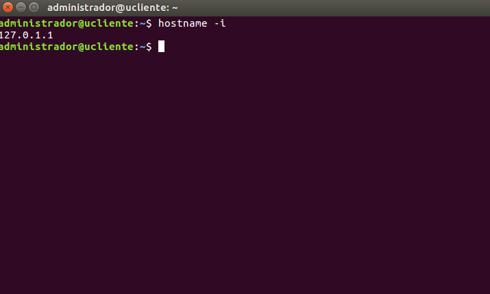
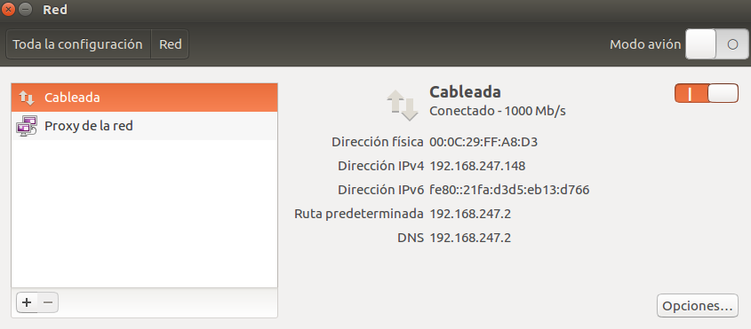
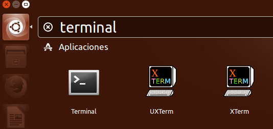
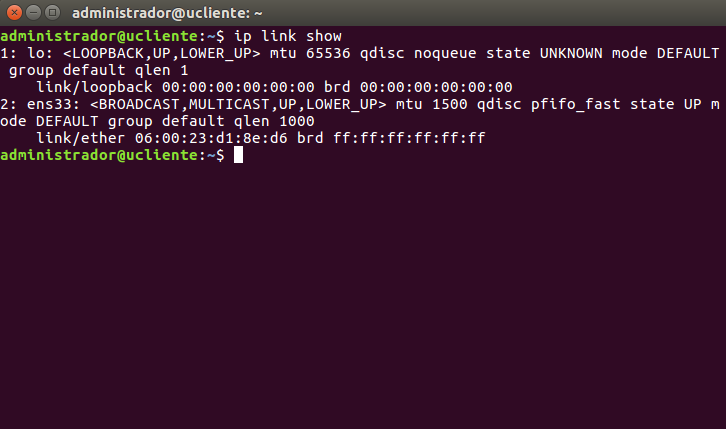
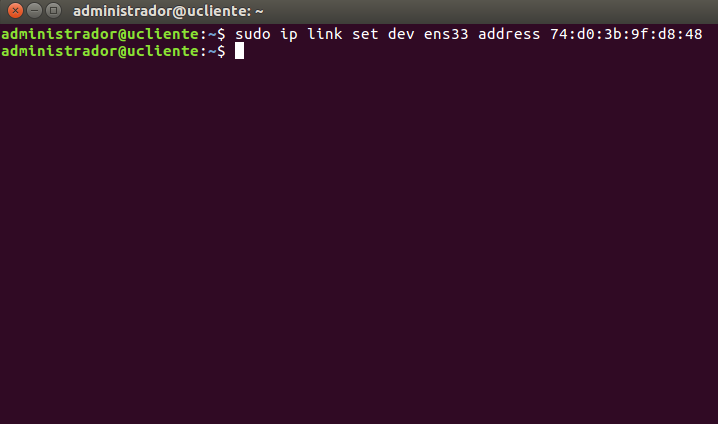
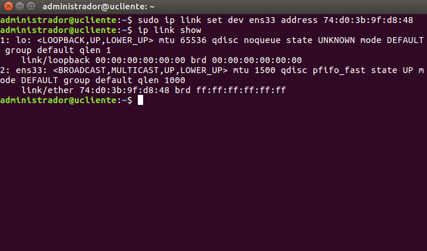
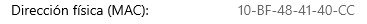

<div id='id100' />

# Práctica 1: Direcciónes IP y MAC en Windows y Linux

 ## **Índice**
 1. [***Ubuntu***](#id1)  
 1.1 [Conocer mi IP](#id2)  
 1.2 [Conocer direccion MAC](#id3)  
 1.3 [Spoofing Ubuntu](#id4)  
 2. [***Windows***](#id5)  
 2.1 [Conocer mi IP](#id44)  
 2.2 [Conocer direccion MAC](#id45)  
 2.3 [Spoofing Windows](#id46)


<div id='id1' />

# Ubuntu :computer:


<div id='id2' />

# Conocer mi IP :shipit:

```
hostname -i
```


<div id='id3' />

# Conocer mi direccion MAC
### Abrir aplicacion RED. Donde pone direccion fisica, eso es nuestra direccion MAC



<div id='id4' />

# 1.1 Spoofing Ubuntu

### Abrimos la terminal


```
ip link show
```



```
sudo ip link set dev ens33 address 74:d0:3b:9f:d8:48
```



```
ip link show
```



<div id='id5' />

# Windows :computer:


<div id='id44' />

# Conocer mi IP :shipit:

```
ipconfig
```


<div id='id45' />

# Conocer direccion MAC
***Configuracion / Estado de red / Propiedades***  




# Spoofing Windows
Entrar a Administrador de Dispositivos.
Seleccionar el apartado de Adaptadores de Red.
Escogemos la interfaz de red a la que queremos cambiar la dirección MAC.
Hacemos clic derecho en lo escogido y seleccionamos la opción «Propiedades«.
Pasamos a la pestaña «Opciones Avanzadas«, luego a la cajita de «Propiedad» y nos encontraremos con Direcciones Administradas Localmente o Locally Administered Address
Fíjate en el campo de texto (Valor) en donde se encuentra la dirección MAC y siéntete libre de borrarlo y cambiarlo
Acto seguido, vuelve a introducir la dirección MAC de tu preferencia, respetando el formato y sin separadores/espacios.
Reinicia el ordenador
Vuelve a ejecutar el cmd
Escribes «ipconfig/all» y listo: dirección MAC alterada.


<div id='id46' />

# [Volver arriba ⬆️](#id100)  
